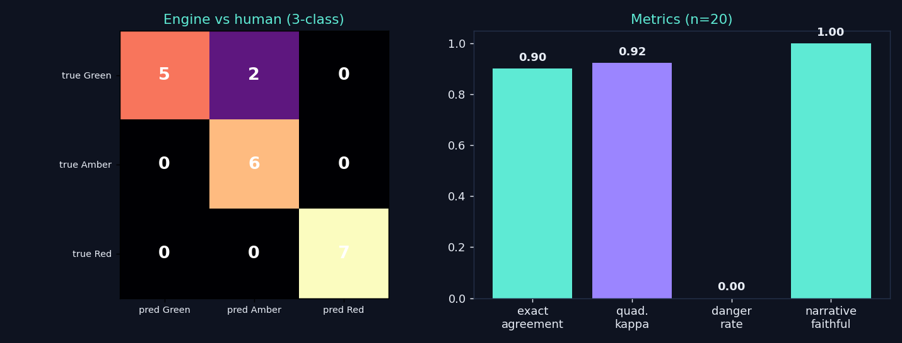

# StatusForge

**A cross-team status roll-up where a deterministic rule engine sets Red/Amber/Green — the LLM only writes the narrative.**

[](https://github.com/singhalpooja9/StatusForge/actions/workflows/ci.yml)


> Paste each team's raw status; a **deterministic engine** computes the program's
> Red/Amber/Green from extracted signals, and the model *only* narrates it. The LLM
> has **no numeric path to the color** — so the health call is auditable, reproducible,
> and can never be argued up by generated prose.
>
> This is the weekly program-health dashboard I've run on real launches, rebuilt as
> public code with the eval to back it. Synthetic data only; runs offline with no keys.

**Live demo:** _(Streamlit Community Cloud — link after deploy)_ · works with no API key
(deterministic engine + offline narrator); bring your own key in-app for live LLM prose.

---

## Why it's built this way

On a weekly program review, the number that matters is the color: is this workstream
**Red**? Letting an LLM *decide* that is a governance mistake — it can't be audited and it
drifts. So StatusForge splits the job:

- **A deterministic rule engine owns the color.** `Red/Amber/Green` is a pure function of
  numeric signals (critical-path slip, open P1s, ownerless blocked deps, scope delta,
  milestone miss). It's in one inspectable place and fully unit-tested.
- **The LLM only narrates.** It's handed the color + the reasons the engine already fired,
  and may only phrase them. A faithfulness check verifies the prose never claims a
  different health level.

The model *proposes* the numbers during extraction (a human can override them); it never
sets the verdict.

## Quickstart

```bash
pip install -r requirements-dev.txt

streamlit run app.py                          # the interactive roll-up (works with no key)
pytest -q                                     # 27 tests, fully offline
python scripts/run_calibration.py             # -> docs/calibration.md + chart (offline)
```

**No API key needed.** The deterministic engine computes every color, and an offline
narrator writes the prose — so the whole demo runs with zero setup. A real LLM is
*optional* and only changes the wording:

- **In the app:** open the **"Use your own key"** tab, pick a provider (Groq / OpenRouter
  are free), paste a key — it stays in your browser session only, never stored or logged,
  and is passed straight to your provider. The Red/Amber/Green never changes.
- **In the script (dev):** `export GROQ_API_KEY=… && python scripts/run_calibration.py --provider auto`.

LiteLLM routes to whatever provider your key matches (Groq, OpenRouter, OpenAI, Anthropic, Gemini).

## Results (offline mock, n=20 gold set)



```
n=20  exact-agreement=0.90  quadratic-weighted kappa=0.92
DANGER RATE (truly-Red under-called)=0.00  (95% CI 0.00–0.35, n_red=7)
narrative faithfulness = 1.00
```

Because the classes are **ordinal** (Green < Amber < Red) and the errors are
**cost-asymmetric**, aggregate accuracy is the wrong headline. The two that matter:
- **Danger rate = 0** — no truly-Red team was under-called (the catastrophic error). The
  only misses are Green→Amber, i.e. *over*-caution — the safe direction.
- **Narrative faithfulness = 1.0** — no generated line ever contradicts the engine's color,
  by construction.

> Honest note: n=20 → wide CIs (the danger-rate CI spans to 0.35 on 7 Red cases). The
> gold set is synthetic and written to be unambiguous for the documented thresholds; it
> demonstrates the *method*, not a production benchmark.

## What this demonstrates (concepts + stack)

| Concept | Where |
|---|---|
| **Deterministic-engine + LLM-narrates** separation (LLM has no numeric path) | `engine.py`, `narrate.py` |
| **Typed signal extraction** (schema the model fills; human-overridable) | `models.py`, `extract.py` (PydanticAI-style) |
| **3-class ordinal, cost-asymmetric eval** | `calibration.py` — quadratic-weighted κ + confusion + Wilson CIs |
| **Danger rate** (under-calling a truly-Red program) as the headline metric | `calibration.py` |
| **Narrative faithfulness** (prose can't contradict the color) | `calibration.py` |
| **Offline-first / deterministic CI** | mock extractor + narrator ⇒ green with no keys |
| **Interactive delivery** | `app.py` (Streamlit) |

**Stack:** Python · Pydantic · Streamlit · LiteLLM (swappable providers) · pandas ·
matplotlib · pytest + GitHub Actions.

## Deploy to Streamlit Community Cloud

1. Push this repo to GitHub (public).
2. On [share.streamlit.io](https://share.streamlit.io) → New app → point at `app.py`.
3. **No secrets required** — it runs fully offline by default; visitors can bring their own
   key in the app. (Optional: to give every visitor live LLM prose in the default view, add a
   `GROQ_API_KEY` in the app's Secrets — a free Groq key — and consider rate-limiting it.)

### A note on the bring-your-own-key design
A visitor's key lives **only** in `st.session_state` and is passed per request as
`api_key=…` straight to LiteLLM. It is **never** written to `os.environ` — Streamlit Cloud
runs one shared process for all visitors, so a process-global key would leak across
concurrent sessions. See [`statusforge/extract.py`](statusforge/extract.py) (`LLMConfig`)
and [`narrate.py`](statusforge/narrate.py) for the exact handling.

## Layout

```
statusforge/
  models.py        # TeamSignals + Verdict + ProgramRollup (Pydantic)
  engine.py        # the deterministic RAG-color rule engine (pure, unit-tested)
  extract.py       # raw status text -> typed signals (offline mock or LLM)
  narrate.py       # engine verdict -> grounded prose (cannot change the color)
  calibration.py   # 3-class ordinal calibration + narrative faithfulness
  dataset.py       # load the synthetic gold set
app.py             # Streamlit roll-up app
data/gold_statuses.jsonl   # 20 synthetic statuses + human color labels
scripts/run_calibration.py # -> docs/calibration.md + docs/calibration.png
tests/             # 26 offline tests (engine + calibration + pipeline)
```

## Honest scope

Working app + eval harness, not a product. Synthetic data only, no integrations, no real
program data. The mock extractor is a transparent keyword/regex reader (reproducible, not
clever); real extraction uses an LLM via LiteLLM. The point is the *architecture* — a
health call you can audit — and the *eval* that proves it.

---

*Part of [The Lab](https://singhalpooja.com) — Pooja Singhal, Senior Technical Program Manager.*
